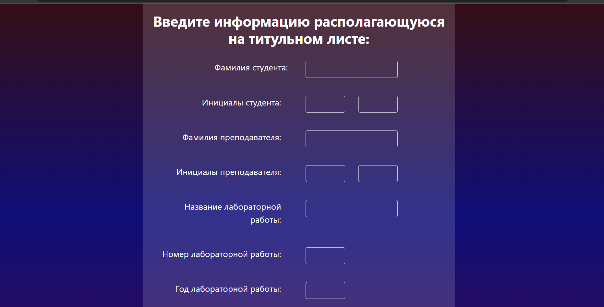
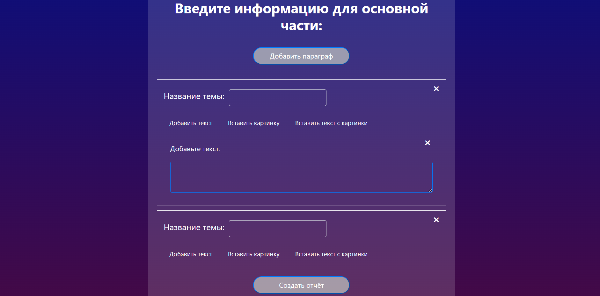

# RepGen
RepGen allows users to create reports by entering their personal information such as last name, initials, as well as their teacher's last name and initials. Additionally, users can specify the report title, number, and year. The application also allows users to input the report text and insert images into the report. Furthermore, the application has the capability to extract text from images. By leveraging this input data, the application generates comprehensive reports.

## Technologies Used:
+ Python
+ Django
+ HTML
+ CSS
+ JavaScript

## Requirements
+ python
+ pip
+ virtualenv

## Setup to run
1. Download zip file to your local machine
2. Extract the zip file
3. Open terminal/cmd prompt
4. Goto that Path \
   Example: 
```
cd ~/Desktop/RepGen-development/RepGen-development
```

5. Create a new virtual environment in that directory

```
python -m pip install virtualenv
python -m venv myenv
```

6. Activate virtual environment
```
.\myenv\Scripts\activate
```

7. Command line to install all dependencies
```
pip install -r requirements.txt
```

8. Then
```
cd src
```

9. Command line to run your program
```
python manage.py runserver
```

10. Now open your browser and go to this address
```
http://127.0.0.1:8000
```

## Screenshots

Main menu


Capture cover page details.


Text and picture input


File download
